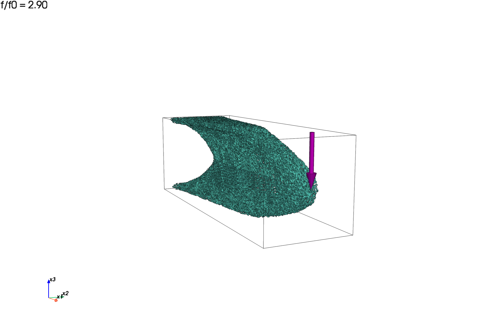
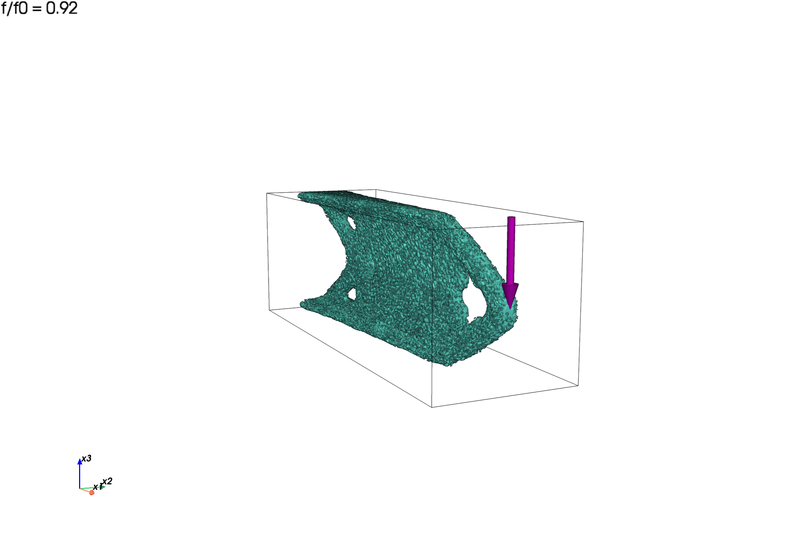
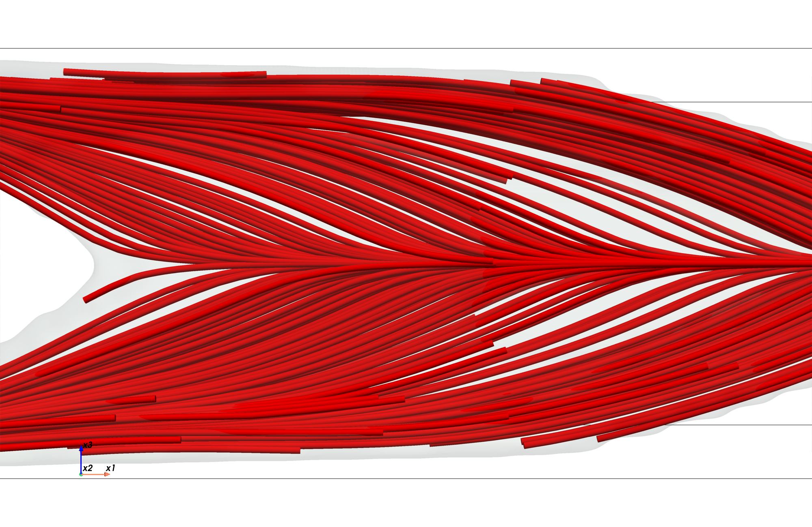
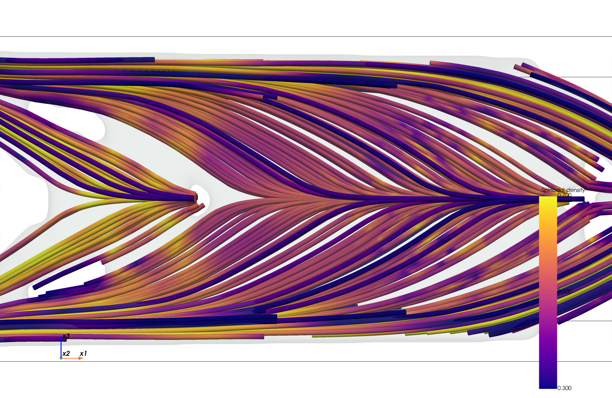
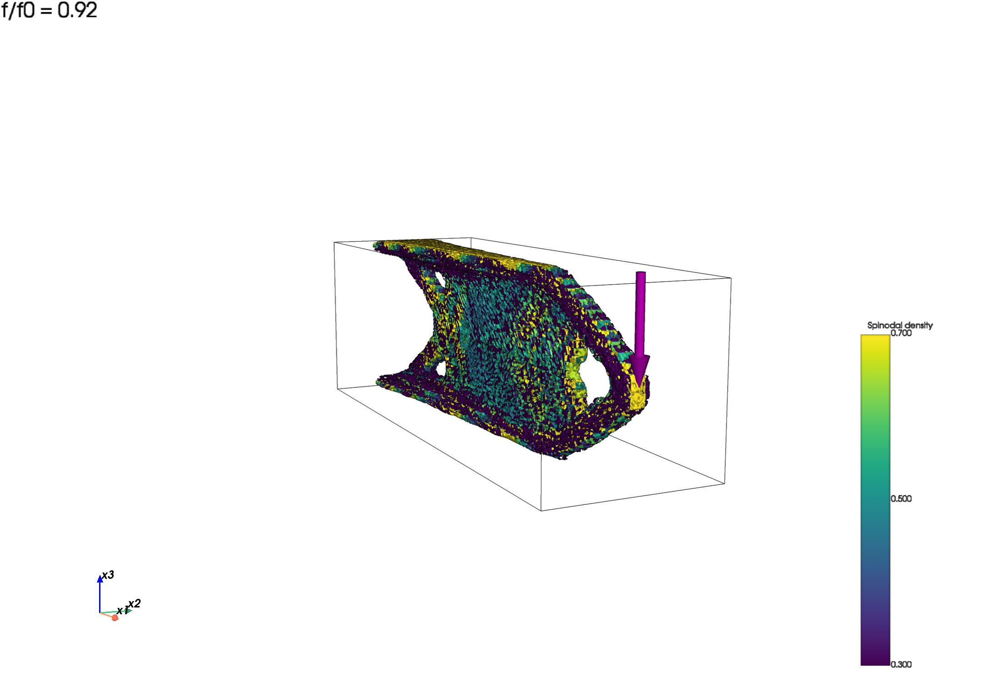
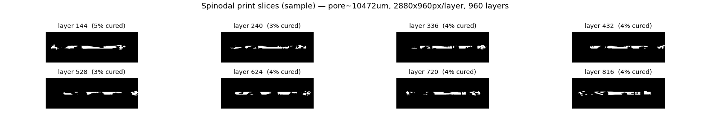

# spinodal_pytopo3d

CPU/GPU-capable Python reproduction of the **spinodal multiscale
compliance-minimization cantilever** from Senhora, Sanders & Paulino,
*Optimally-Tailored Spinodal Architected Materials for Multiscale Design and
Manufacturing*, **Adv. Mater. 2022** (Fig. 5), built on the
[PyTopo3D](PyTopo3D-main) finite-element backbone.

This implementation intentionally starts with the paper's dominant cantilever
case: a single **columnar** spinodal class. Each element optimizes:

- macro presence `z` with density filtering, Heaviside projection, and SIMP;
- spinodal solid fraction `Frac` in `[0.3, 0.7]` (not filtered);
- orientation angles `(alpha, beta, gamma)`.

The element constitutive matrix is assembled from the homogenized material data:

```text
D_e = E_SIMP(z_bar) * N(alpha,beta,gamma)^T * D^H_columnar(Frac) * N(alpha,beta,gamma)
```

Optimization uses homogenized stiffness tensors only. Explicit GRF spinodal
pores are generated later for rendering/STL/slicing.

## Results

> **Verification history.** This branch fuses the two development lines
> (`main`'s corrected-physics rerun and the `codex-v1`/`si-fidelity` line's
> SI-fidelity work). Silent bugs were found and fixed by adding
> independent-reference self-tests; the gallery below uses the `_fig5v3`
> fields computed under the fully corrected model:
> 1. **Bond/Voigt rotation** (both lines, 2026-06-10): three shear-row entries
>    missing a factor 2, and an effective `U^T` rotation that put the stiff
>    axis at `U[2,:]` while orientation was interpreted as `U[:,2]` (both
>    inherited from the released TO_Spinodal code; caught by `_rot_check.py`,
>    an `np.einsum` 4th-order tensor rotation cross-check).
> 2. **Element/edof node ordering** (both lines, 2026-06-10): PyTopo3D's
>    `lk_H8` uses the textbook x-first local node ring while PyTopo3D's own
>    `build_edof` wires y-first; mixing them scrambles assembled physics
>    (isotropic bar ~37x too compliant, columnar Young's anisotropy 11.5x
>    collapsed to ~1.1x). Caught by `_bar_check.py` (assembled bar vs analytic
>    compliance), which element-level and self-consistent FD tests provably
>    cannot catch. Only the `_fig5v3` results were recomputed after this fix.
> 3. **Eq. S4 columnar wave-vector cones** (si-fidelity line, 2026-06-11): the
>    GRF sampler used the whole equatorial band `|v.e3| < sin(30 deg)` -- a
>    superset of Eq. S4's 30-degree cones around `+-x1`/`+-x2` that renders a
>    transversely-isotropic microstructure inconsistent with the
>    `CH_columnar_xy` homogenization data. Affects rendering/STL/slicing only,
>    not the optimization; gated by the new `_micro_check` cone test. The
>    gallery renders below are regenerated from the `_fig5v3` fields with the
>    corrected sampler.
> 4. **Density-filter builder** (si-fidelity line, 2026-06-11): PyTopo3D's
>    `build_filter` needs >15 GB at the paper's 324k-element mesh AND silently
>    drops true neighbors whenever `nely != nelz` (its KD-tree candidate set
>    uses z-fastest raveling while the integer-distance pruning assumes the
>    y-fastest element order). The driver now uses the vectorized
>    `fast_filter.build_filter_fast`, gated bit-exact against a brute-force
>    reference by `_filter_check.py`. All committed results used
>    `nely == nelz` meshes and are unaffected, except the exploratory
>    `_fig5_halfy_pad` run (72x12x24).
>
> The si-fidelity line also adds a `--si-schedule` optimizer mode implementing
> the SI's published AL scheme (Eq. S11/S12): unconditional `mu *= 1.25` every
> 5 iterations, deterministic step decay `tau = max(0.99*tau, 0.01)`, initial
> Heaviside `xi = 0.1`, and per-continuation-step early advance at
> `tol = 0.02`. It is an opt-in research mode and NOT claimed to converge
> faster: the si-fidelity branch reported the SI schedule enforcing the volume
> constraint much faster than the legacy heuristic, but that claim does not
> reproduce -- on a 16x8x8 `--fig5` truss smoke run the legacy updater reaches
> |g| < 5e-4 by iteration ~140 of the p=1 stage while the SI schedule is still
> at g ~ +0.05 (the unconditional mu growth is offset by the tau decay; g does
> decrease monotonically but more slowly). Defaults are unchanged: the legacy
> TO_Spinodal updater (which produced the v3 results) remains the default.

Fig. 5-style final renderings generated from the corrected saved fields with
the Eq. S4 cone-restricted sampler. The
gallery uses a dense presentation render (`m=1.5`, `n_waves=120`) because the
paper's physical pore wavelength is visually too coarse on this reduced mesh.





Columnar stiff-axis streamlines (cf. paper Fig. 5b/5e: principal-stress arcs):





Density-colored truss and print-slice preview:





Results with the consistent solid-isotropic baseline (same optimizer, same
centered tip load for `f` and `f0`; `f0 = 100.13` on the 72x24x24 mesh):

| case | saved field | density policy | f/f0 (ours) | f/f0 (paper) |
| --- | --- | --- | ---: | ---: |
| shell | `cantilever_shell_fig5v3.npz` | `Frac = 0.3` fixed | **2.90** | 2.99 |
| truss | `cantilever_truss_fig5v3.npz` | `0.3 <= Frac <= 0.7` optimized | **0.92** | 0.86 |

Both headline results of the paper are reproduced: the fixed-porosity shell
trades stiffness for porosity (`f/f0 > 1`), and the variable-density truss
*outperforms* the standard solid solution (`f/f0 < 1`). The truss spinodal
density is bounds-seeking as the paper reports (S4.3): 37% of elements at
`Frac >= 0.65` (paper: >60%) and 19% at `Frac <= 0.35` (paper: <20%); the
remaining gap tracks the 16x coarser mesh (72x24x24 full domain here vs
180x60x60 with half-domain symmetry in the paper) and the single-columnar
simplification (no four-material `Z_i` selection).

Load-model note: the `_fig5v3` fields were computed with the centered tip
load distributed over the end element's 8 corner nodes (the pre-merge
driver). The current `--load tip` applies a *true* nodal point load at the
free-end face center (from the codex line); combine it with
`--load-pad-radius` to regularize the point-load singularity. Earlier
codex-line results kept under `results/` (`*_point48*`, `*_fig5_halfy_pad*`)
demonstrate that load model but predate the node-ordering fix, so their
compliance numbers are invalid.

## Connectivity & cleanliness

A practical concern for 3D printing is whether the optimized microstructure
breaks into many disconnected fragments. It does not. The clean `gamma=12` truss
render below shows continuous members with no floating debris:


This is by design: the supplementary information (Fig. S1) shows spinodal
microstructures start to disconnect below `rho ~ 0.25`, which is why the
optimization bounds the spinodal solid fraction to `rho in [0.3, 0.7]` -- the
lower bound guarantees connected microstructure everywhere.

3D connected-component labelling (`scipy.ndimage.label`, 26-connectivity) on the
thresholded voxel solid confirms a single dominant body in every case: the
largest component holds **> 99.9 %** of the material, and the handful of stray
voxels are sub-resolution surface specks, not structural fragments.

| structure | components | floater voxels removed | fraction |
| --- | ---: | ---: | ---: |
| truss (`spc = 16`) | 10 | 14 | 0.0 % |
| truss64 (`gamma = 12`) | 26 | 178 | 0.0 % |
| Fig. 5 shell | 2 | 7 | 0.0 % |
| Fig. 5 truss | 10 | 112 | 0.0 % |

The large "piece counts" seen at coarse sampling (e.g. ~1000 fragments at
`spc = 12`) are a marching-cubes artifact of undersampling the pore walls, not
real disconnected solid; they vanish at `spc >= 16`. The optional `--declutter`
flag runs keep-largest-component on the voxel solid so the exported STL is a
single, watertight body:

```powershell
.\.venv\Scripts\python.exe -m spinodal_pytopo3d.render_spinodal `
    spinodal_pytopo3d/results/cantilever_truss_64.npz --m 1.5 --declutter --save-stl truss.stl
```

## Setup

From the repository root:

```powershell
py -3.13 -m venv .venv
.\.venv\Scripts\python.exe -m pip install numpy scipy scikit-learn matplotlib trimesh scikit-image pyvista pypardiso
```

Optional GPU solve:

```powershell
.\.venv\Scripts\python.exe -m pip install cupy-cuda12x `
  nvidia-cuda-runtime-cu12 nvidia-cublas-cu12 nvidia-cusparse-cu12 nvidia-cusolver-cu12 `
  nvidia-cuda-nvrtc-cu12 nvidia-nvjitlink-cu12 nvidia-cufft-cu12 nvidia-curand-cu12
```

Add `--use-gpu` to use warm-started CuPy CG + Jacobi. Assembly and
sensitivities still run on CPU; the reduced linear solve moves to GPU.

## Run

Default quick reproduction:

```powershell
.\.venv\Scripts\python.exe -m spinodal_pytopo3d.run_cantilever `
    --nelx 32 --nely 16 --nelz 16 --volfrac 0.05 --rmin 1.5 --maxiter 300 --case both
```

Fig. 5-aligned mode:

```powershell
.\.venv\Scripts\python.exe -m spinodal_pytopo3d.run_cantilever `
    --nelx 72 --nely 24 --nelz 24 --volfrac 0.05 --maxiter 550 `
    --case both --fig5 --tag _fig5
```

`--fig5` switches to the concentrated tip load, `R=0.4 cm` filter scaling,
`Emin=1e-4`, paper-style p-continuation, additive Heaviside beta continuation,
and the SI-style orientation staggered update schedule. Add `--si-schedule`
for the SI's exact AL update (Eq. S11/S12: unconditional `mu*=1.25` every 5
iterations, `tau=0.99^k` step decay, `xi0=0.1`, continuation `tol=0.02`); see
the verification-history note for measured convergence behavior vs the
default legacy updater.

The paper itself solves the cantilever on a half-width domain with 324,000
elements (SI S4.1: 180x30x60 at 0.8 mm, so R = 0.4 cm = 5 elements). The
corresponding configuration here is:

```powershell
.\.venv\Scripts\python.exe -m spinodal_pytopo3d.run_cantilever `
    --nelx 180 --nely 30 --nelz 60 --volfrac 0.05 --maxiter 1250 `
    --case truss --fig5 --si-schedule --symmetry half-y --tag _paper
```

(~1M DOF; needs a large-memory machine or `--use-gpu`. The full SI schedule
runs ~450 continuation + ~750 beta-ramp iterations.)

The SI also solves the cantilever on a half-width domain with a symmetry plane
parallel to `x1-x3`. This is available with:

```powershell
.\.venv\Scripts\python.exe -m spinodal_pytopo3d.run_cantilever `
    --nelx 72 --nely 12 --nelz 24 --volfrac 0.05 --maxiter 700 `
    --case truss --fig5 --tag _fig5_halfy_pad --symmetry half-y --load-pad-radius 2.0
```

Saved `.npz` files now also store run diagnostics: `load_info` (loaded node
coordinates and force components, e.g. `[[72, 12, 12, 2, -1]]` for a single
`-x3` force at `(x1=L, x2=center, x3=center)`), `fixed_dof_count`,
`passive_z`, `load_pad_radius`/`load_pad_frac`, and `symmetry`.

## Post-Processing

Standalone export:

```powershell
.\.venv\Scripts\python.exe -m spinodal_pytopo3d.export spinodal_pytopo3d/results/cantilever_truss_fig5v3.npz --vtk
```

Embedded microstructure render:

```powershell
.\.venv\Scripts\python.exe -m spinodal_pytopo3d.render_spinodal `
    spinodal_pytopo3d/results/cantilever_truss_fig5v3.npz --m 1.5 --samples-per-cell 8 --n-waves 120 `
    --declutter --presentation
```

For physical Fig. 5 pore wavelength, use `--gamma 6 --element-mm 2`; on the
current reduced mesh that looks much coarser and less continuous than the paper's
much finer optimization grid. For half-domain (`--symmetry half-y`) results,
add `--mirror-y` to `render_spinodal`/`render_streamlines` to mirror the saved
half-width fields (including the reflected stiff-axis orientation) into a
full-width presentation render.

Print-slice preview:

```powershell
.\.venv\Scripts\python.exe -m spinodal_pytopo3d.slice_print `
    spinodal_pytopo3d/results/cantilever_truss_fig5v3.npz --gamma 6 --element-mm 2 --sample 8
```

Manufacturing convention: `Frac` is the spinodal **solid** fraction. The GRF
level set therefore uses `phi <= sqrt(2)*erfinv(2*Frac-1)`, so thresholded
microstructure volume is approximately `Frac`.

## Modules

| file | role |
| --- | --- |
| `fea_element.py` | H8 B-matrix and anisotropic per-element stiffness |
| `spinodal_material.py` | `D^H(Frac)` polynomial, Voigt rotation, analytic derivatives |
| `interpolation.py` | macro SIMP + Heaviside projection |
| `spinodal_fea.py` | assembly, solve, compliance, and sensitivities |
| `optimizer.py` | augmented-Lagrangian updates (legacy + SI Eq. S10-S12 schedules) and angle sub-iterations |
| `fast_filter.py` | vectorized density-filter builder (drop-in for PyTopo3D's `build_filter`) |
| `simp_baseline.py` | standalone solid-isotropic SIMP/OC baseline |
| `run_cantilever.py` | driver and result serialization |
| `render_spinodal.py` | embedded GRF microstructure rendering and STL export |
| `render_streamlines.py` | stiff-axis streamline rendering |
| `slice_print.py` | layer-wise binary slice generation |

## Self-Tests

```powershell
.\.venv\Scripts\python.exe spinodal_pytopo3d\fea_element.py
.\.venv\Scripts\python.exe spinodal_pytopo3d\spinodal_material.py
.\.venv\Scripts\python.exe -m spinodal_pytopo3d._fd_check
.\.venv\Scripts\python.exe -m spinodal_pytopo3d._micro_check
.\.venv\Scripts\python.exe -m spinodal_pytopo3d._rot_check
.\.venv\Scripts\python.exe -m spinodal_pytopo3d._bar_check
.\.venv\Scripts\python.exe -m spinodal_pytopo3d._filter_check
```

Validated checks include H8 stiffness agreement with PyTopo3D `lk_H8`, material
and rotation finite-difference checks, full FEA sensitivity finite differences,
the manufacturing level-set solid-fraction convention, the Eq. S4 columnar
wave-vector cone restriction, and the density-filter builder (bit-exact vs a
brute-force reference). `_rot_check`
cross-validates the assembly's Voigt/Bond rotation against an independent
4th-order tensor rotation (`np.einsum`): exact equivalence at random oblique
angles, isotropy invariance of the solid, and the 90-degree stiff-axis swap
consistent with `stiff_axis() = U[:,2]`.
