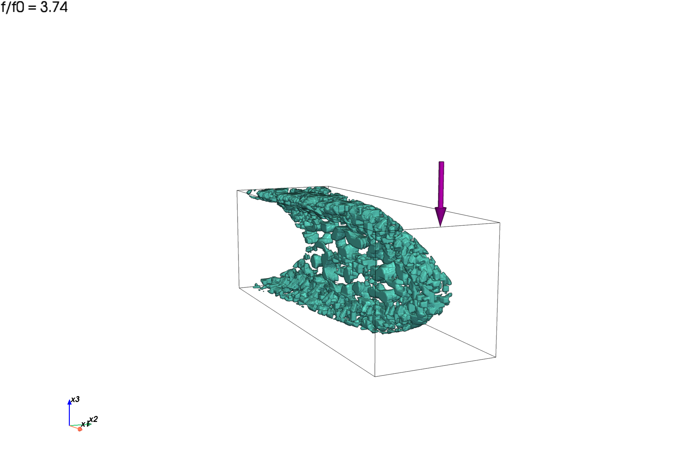
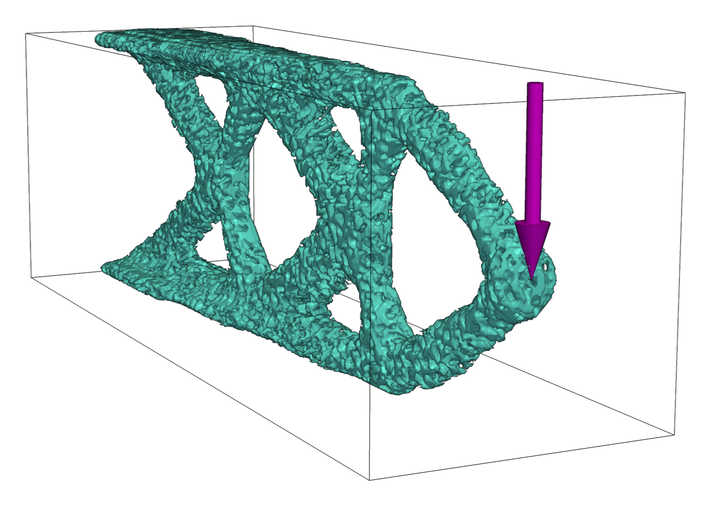
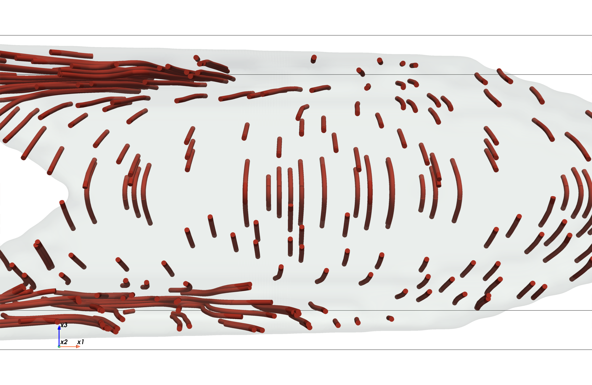
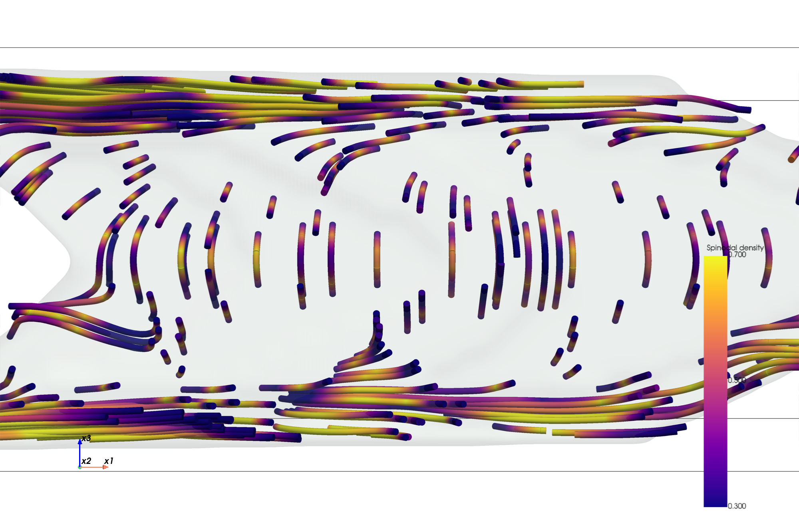
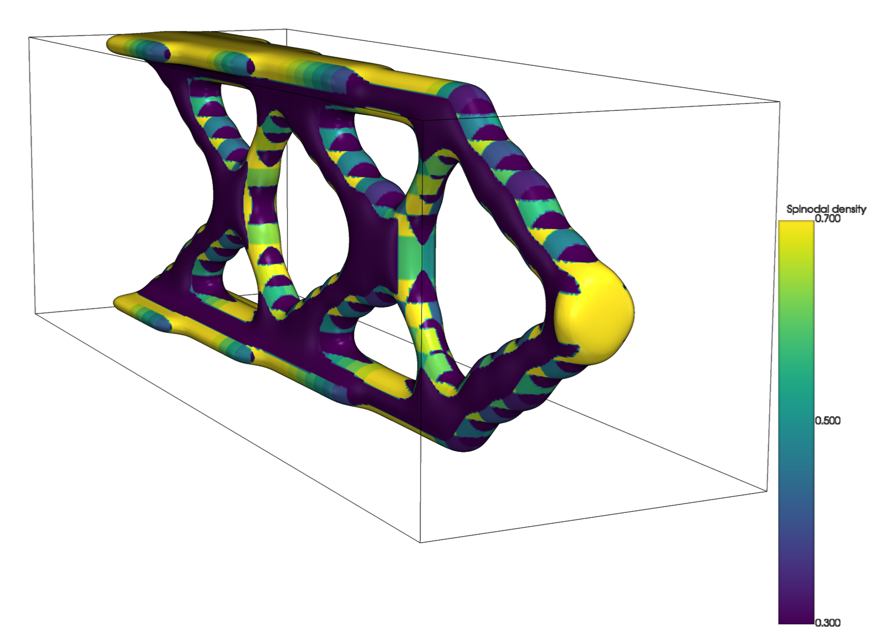
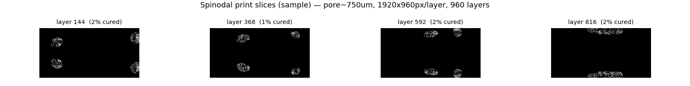
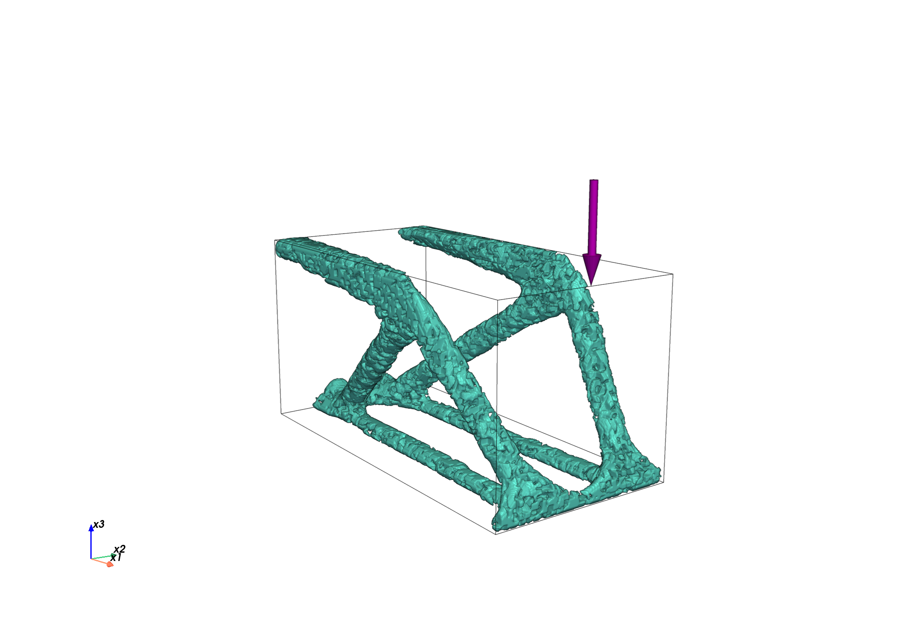

# spinodal_pytopo3d

CPU/GPU-capable Python reproduction of the **spinodal multiscale
compliance-minimization cantilever** from Senhora, Sanders & Paulino,
*Optimally-Tailored Spinodal Architected Materials for Multiscale Design and
Manufacturing*, **Adv. Mater. 2022** (Fig. 5), built on the
[PyTopo3D](PyTopo3D-main) finite-element backbone.

This implementation intentionally starts with the paper's dominant cantilever
case: a single **columnar** spinodal class. Each element optimizes:

- macro presence `z` with density filtering, Heaviside projection, and SIMP;
- spinodal solid fraction `Frac` in `[0.3, 0.7]` (not filtered);
- orientation angles `(alpha, beta, gamma)`.

The element constitutive matrix is assembled from the homogenized material data:

```text
D_e = E_SIMP(z_bar) * N(alpha,beta,gamma)^T * D^H_columnar(Frac) * N(alpha,beta,gamma)
```

Optimization uses homogenized stiffness tensors only. Explicit GRF spinodal
pores are generated later for rendering/STL/slicing.

## Results

> **Update 3 (2026-06-11): two SI-fidelity fixes after a line-by-line audit
> against the paper's Supporting Information.** (a) The columnar wave-vector
> sampler now follows Eq. S4 exactly: vectors restricted to the 30-degree cones
> around the +-x1/+-x2 axes with 15% uniform leakage, instead of the previous
> whole equatorial band (a superset that renders a transversely-isotropic
> microstructure inconsistent with the CH_columnar_xy homogenization data).
> Affects rendering/STL/slicing only, not the optimization. (b) New
> `--si-schedule` flag switches the optimizer to the SI's published AL scheme
> (Eq. S11/S12): unconditional `mu *= 1.25` every 5 iterations, deterministic
> step decay `tau = max(0.99*tau, 0.01)`, initial Heaviside `xi = 0.1`, and
> per-continuation-step early advance at `tol = 0.02`. The default updater
> (ported from the released TO_Spinodal code) grows `mu` far more slowly and
> can leave the volume constraint badly violated for hundreds of iterations;
> on a 16x8x8 smoke mesh the SI schedule reaches |g| < 1e-3 by iteration ~60
> while the legacy schedule is still at g ~ +0.15 (3x over budget). Also
> replaced PyTopo3D's `build_filter` in the driver with a vectorized
> equivalent (`fast_filter.py`): the upstream builder needs >15 GB at the
> paper mesh AND silently drops true neighbors whenever `nely != nelz` (its
> KD-tree candidate set uses z-fastest raveling while the integer-distance
> pruning assumes the y-fastest element order; `_filter_check.py` gates the
> new builder against a brute-force reference). All prior committed results
> used `nely == nelz` meshes and are unaffected, except the exploratory
> `_fig5_halfy_pad` run (72x12x24).
>
> **Update 2 (2026-06-10, evening): node-ordering bug found in assembly —
> all numerical results below are invalid and being recomputed.** A new
> end-to-end gate (`_bar_check.py`: assembled solid bar vs analytic compliance)
> exposed that PyTopo3D's `lk_H8` element matrix (textbook x-first node ring)
> is inconsistent with PyTopo3D's own `build_edof` (y-first node ring). Our
> element matrices had been built in the lk_H8 order and assembled with the
> build_edof wiring, which silently scrambles the physics: an isotropic bar
> came out ~37x too compliant and the columnar Young's anisotropy collapsed
> from 11.5x to ~1.1x. Element-level gates (KE==lk_H8, FD sensitivities,
> einsum rotation) are all blind to this mismatch. `fea_element._NAT` now
> follows the build_edof ring (validated by `_bar_check`), and `validate()`
> compares against `lk_H8` after the node permutation. Topology *shapes* below
> remain qualitatively meaningful (compliance optimization under a consistent,
> if wrong, SPD model), but every compliance number, `f/f0` ratio, and
> orientation field predates this fix.
>
> **Update 1 (2026-06-10):** corrected Voigt/Bond rotation (missing factor 2 +
> `U^T` convention), manufacturing level-set sign `phi <= cutoff(Frac)`, true
> nodal load at the free-end face center, optional passive load pad.

Fig. 5-style final renderings generated from the saved optimization fields. The
gallery uses a dense presentation render (`m=1.5`, `n_waves=120`) because the
paper's physical pore wavelength is visually too coarse on this reduced mesh.





Columnar stiff-axis streamlines:





Density-colored truss and print-slice preview:





Current saved fields shown in the gallery:

| case | saved field | density policy | f/f0 | load setting |
| --- | --- | --- | ---: | --- |
| shell | `cantilever_shell_point48_b1.npz` | `Frac = 0.3` fixed | 3.68 | centered free-end nodal load |
| truss | `cantilever_truss_point48_pad_b1.npz` | `0.3 <= Frac <= 0.7` optimized | 1.11 | centered free-end nodal load + passive load pad |

The qualitative shell/truss morphology and orientation-field behavior are
reproduced, but this reduced single-columnar run is not an exact numerical
match to the paper values (`2.99` for Fig. 5a and `0.86` for Fig. 5d). The main
remaining differences are the much coarser mesh, no four-material `Z_i`
selection, and a density distribution that still under-uses the upper
spinodal-density bound: the current truss has `Frac >= 0.65` in 19.4% of
elements, whereas the paper reports over 60%.

## Connectivity & cleanliness

A practical concern for 3D printing is whether the optimized microstructure
breaks into many disconnected fragments. It does not. The clean `gamma=12` truss
render below shows continuous members with no floating debris:



This is by design: the supplementary information (Fig. S1) shows spinodal
microstructures start to disconnect below `rho ~ 0.25`, which is why the
optimization bounds the spinodal solid fraction to `rho in [0.3, 0.7]` -- the
lower bound guarantees connected microstructure everywhere.

3D connected-component labelling (`scipy.ndimage.label`, 26-connectivity) on the
thresholded voxel solid confirms a single dominant body in every case: the
largest component holds **> 99.9 %** of the material, and the handful of stray
voxels are sub-resolution surface specks, not structural fragments.

| structure | components | floater voxels removed | fraction |
| --- | ---: | ---: | ---: |
| truss (`spc = 16`) | 10 | 14 | 0.0 % |
| truss64 (`gamma = 12`) | 26 | 178 | 0.0 % |
| Fig. 5 shell | 2 | 7 | 0.0 % |
| Fig. 5 truss | 10 | 112 | 0.0 % |

The large "piece counts" seen at coarse sampling (e.g. ~1000 fragments at
`spc = 12`) are a marching-cubes artifact of undersampling the pore walls, not
real disconnected solid; they vanish at `spc >= 16`. The optional `--declutter`
flag runs keep-largest-component on the voxel solid so the exported STL is a
single, watertight body:

```powershell
.\.venv\Scripts\python.exe -m spinodal_pytopo3d.render_spinodal `
    spinodal_pytopo3d/results/cantilever_truss_64.npz --m 1.5 --declutter --save-stl truss.stl
```

## Setup

From the repository root:

```powershell
py -3.13 -m venv .venv
.\.venv\Scripts\python.exe -m pip install numpy scipy scikit-learn matplotlib trimesh scikit-image pyvista pypardiso
```

Optional GPU solve:

```powershell
.\.venv\Scripts\python.exe -m pip install cupy-cuda12x `
  nvidia-cuda-runtime-cu12 nvidia-cublas-cu12 nvidia-cusparse-cu12 nvidia-cusolver-cu12 `
  nvidia-cuda-nvrtc-cu12 nvidia-nvjitlink-cu12 nvidia-cufft-cu12 nvidia-curand-cu12
```

Add `--use-gpu` to use warm-started CuPy CG + Jacobi. Assembly and
sensitivities still run on CPU; the reduced linear solve moves to GPU.

## Run

Default quick reproduction:

```powershell
.\.venv\Scripts\python.exe -m spinodal_pytopo3d.run_cantilever `
    --nelx 32 --nely 16 --nelz 16 --volfrac 0.05 --rmin 1.5 --maxiter 300 --case both
```

Fig. 5-aligned mode:

```powershell
.\.venv\Scripts\python.exe -m spinodal_pytopo3d.run_cantilever `
    --nelx 72 --nely 24 --nelz 24 --volfrac 0.05 --maxiter 550 `
    --case both --fig5 --tag _fig5
```

`--fig5` switches to the concentrated tip load, `R=0.4 cm` filter scaling,
`Emin=1e-4`, paper-style p-continuation, additive Heaviside beta continuation,
and the SI-style orientation staggered update schedule. Add `--si-schedule`
for the SI's exact AL update (Eq. S11/S12: unconditional `mu*=1.25` every 5
iterations, `tau=0.99^k` step decay, `xi0=0.1`, continuation `tol=0.02`) —
this enforces the volume constraint much faster than the legacy updater.

The paper itself solves the cantilever on a half-width domain with 324,000
elements (SI S4.1: 180x30x60 at 0.8 mm, so R = 0.4 cm = 5 elements). The
corresponding configuration here is:

```powershell
.\.venv\Scripts\python.exe -m spinodal_pytopo3d.run_cantilever `
    --nelx 180 --nely 30 --nelz 60 --volfrac 0.05 --maxiter 1250 `
    --case truss --fig5 --si-schedule --symmetry half-y --tag _paper
```

(~1M DOF; needs a large-memory machine or `--use-gpu`. The full SI schedule
runs ~450 continuation + ~750 beta-ramp iterations.)

The SI also solves the cantilever on a half-width domain with a symmetry plane
parallel to `x1-x3`. This is available with:

```powershell
.\.venv\Scripts\python.exe -m spinodal_pytopo3d.run_cantilever `
    --nelx 72 --nely 12 --nelz 24 --volfrac 0.05 --maxiter 700 `
    --case truss --fig5 --tag _fig5_halfy_pad --symmetry half-y --load-pad-radius 2.0
```

For the gallery images, the current laptop-sized rerun uses `48x16x16`:

```powershell
.\.venv\Scripts\python.exe -m spinodal_pytopo3d.run_cantilever `
    --nelx 48 --nely 16 --nelz 16 --volfrac 0.05 --maxiter 700 `
    --case shell --fig5 --tag _point48_b1

.\.venv\Scripts\python.exe -m spinodal_pytopo3d.run_cantilever `
    --nelx 48 --nely 16 --nelz 16 --volfrac 0.05 --maxiter 700 `
    --case truss --fig5 --tag _point48_pad_b1 --load-pad-radius 2.0
```

The resulting `.npz` files store `load_info = [[48, 8, 8, 2, -1]]`, meaning a
single `-x3` force at `(x1=L, x2=center, x3=center)`.

## Post-Processing

Standalone export:

```powershell
.\.venv\Scripts\python.exe -m spinodal_pytopo3d.export spinodal_pytopo3d/results/cantilever_truss_point48_pad_b1.npz --vtk
```

Embedded microstructure render:

```powershell
.\.venv\Scripts\python.exe -m spinodal_pytopo3d.render_spinodal `
    spinodal_pytopo3d/results/cantilever_truss_point48_pad_b1.npz --m 1.5 --samples-per-cell 8 --n-waves 120 `
    --declutter --presentation
```

For physical Fig. 5 pore wavelength, use `--gamma 6 --element-mm 2`; on the
current reduced mesh that looks much coarser and less continuous than the paper's
much finer optimization grid.

Print-slice preview:

```powershell
.\.venv\Scripts\python.exe -m spinodal_pytopo3d.slice_print `
    spinodal_pytopo3d/results/cantilever_truss_point48_pad_b1.npz --gamma 6 --element-mm 2 --sample 8
```

Manufacturing convention: `Frac` is the spinodal **solid** fraction. The GRF
level set therefore uses `phi <= sqrt(2)*erfinv(2*Frac-1)`, so thresholded
microstructure volume is approximately `Frac`.

## Modules

| file | role |
| --- | --- |
| `fea_element.py` | H8 B-matrix and anisotropic per-element stiffness |
| `spinodal_material.py` | `D^H(Frac)` polynomial, Voigt rotation, analytic derivatives |
| `interpolation.py` | macro SIMP + Heaviside projection |
| `spinodal_fea.py` | assembly, solve, compliance, and sensitivities |
| `optimizer.py` | augmented-Lagrangian normalized-gradient update and angle sub-iterations |
| `simp_baseline.py` | standalone solid-isotropic SIMP/OC baseline |
| `run_cantilever.py` | driver and result serialization |
| `render_spinodal.py` | embedded GRF microstructure rendering and STL export |
| `render_streamlines.py` | stiff-axis streamline rendering |
| `slice_print.py` | layer-wise binary slice generation |

## Self-Tests

```powershell
.\.venv\Scripts\python.exe spinodal_pytopo3d\fea_element.py
.\.venv\Scripts\python.exe spinodal_pytopo3d\spinodal_material.py
.\.venv\Scripts\python.exe -m spinodal_pytopo3d._fd_check
.\.venv\Scripts\python.exe -m spinodal_pytopo3d._micro_check
.\.venv\Scripts\python.exe -m spinodal_pytopo3d._rot_check
.\.venv\Scripts\python.exe -m spinodal_pytopo3d._bar_check
.\.venv\Scripts\python.exe -m spinodal_pytopo3d._filter_check
```

Validated checks include H8 stiffness agreement with PyTopo3D `lk_H8`, material
and rotation finite-difference checks, full FEA sensitivity finite differences,
the manufacturing level-set solid-fraction convention, and the Eq. S4 columnar
wave-vector cone restriction. `_rot_check`
cross-validates the assembly's Voigt/Bond rotation against an independent
4th-order tensor rotation (`np.einsum`): exact equivalence at random oblique
angles, isotropy invariance of the solid, and the 90-degree stiff-axis swap
consistent with `stiff_axis() = U[:,2]`.
