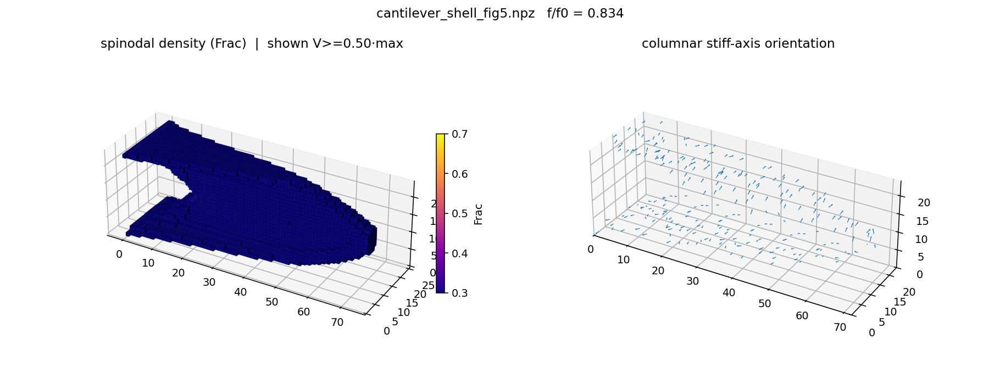
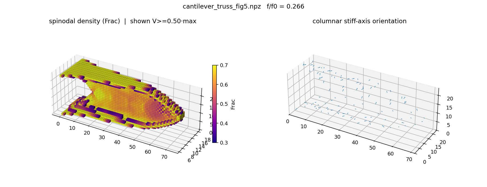

# Spinodal-Pytopo3d

Python reproduction of the 3D spinodal multiscale compliance-minimization
cantilever from Senhora, Sanders, and Paulino, "Optimally-Tailored Spinodal
Architected Materials for Multiscale Design and Manufacturing", Adv. Mater. 2022.

This repository contains:

- A modular spinodal topology-optimization implementation in `spinodal_pytopo3d/`.
- A vendored PyTopo3D backbone in `PyTopo3D-main/`.
- The homogenized material coefficient table in `materials/coefficients_3d.mat`.
- Saved result fields and rendered figures in `spinodal_pytopo3d/results/`.

## Result Gallery

Final Fig. 5-style shell and truss renderings:


Orientation streamlines of the optimized columnar stiff axis:


Density-colored truss microstructure and design views:






Example print-slice preview:


Large STL meshes are intentionally not committed because several generated files
are above GitHub's 100 MB single-file limit. They can be regenerated from the
saved `.npz` result files with `render_spinodal.py --save-stl`.

## Numerical Summary

The current Fig. 5-aligned run uses a consistent solid-isotropic baseline:

| Case | Description | f/f0 |
| --- | --- | ---: |
| shell | spinodal density fixed at rho=0.3 | 3.74 |
| truss | spinodal density optimized in [0.3, 0.7] | 1.19 |

The qualitative Fig. 5 behavior, topology, and orientation field are reproduced.
The exact paper-scale truss result requires a much finer mesh than is practical on
the current workstation run.

## Setup

On Windows PowerShell:

```powershell
py -3.13 -m venv .venv
.\.venv\Scripts\python.exe -m pip install --upgrade pip
.\.venv\Scripts\python.exe -m pip install -r requirements.txt
```

Optional GPU solving uses CuPy and CUDA 12 packages. The CPU path is the default
and is the validated route for the included checks.

## Run

From the repository root:

```powershell
.\.venv\Scripts\python.exe -m spinodal_pytopo3d.run_cantilever `
    --nelx 32 --nely 16 --nelz 16 --volfrac 0.05 --rmin 1.5 --maxiter 300 --case both
```

Faithful Fig. 5-style mode:

```powershell
.\.venv\Scripts\python.exe -m spinodal_pytopo3d.run_cantilever `
    --nelx 72 --nely 24 --nelz 24 --volfrac 0.05 --maxiter 550 `
    --case both --fig5 --tag _fig5
```

Export and rendering examples:

```powershell
.\.venv\Scripts\python.exe -m spinodal_pytopo3d.export `
    spinodal_pytopo3d/results/cantilever_truss_fig5.npz --vtk

.\.venv\Scripts\python.exe -m spinodal_pytopo3d.render_spinodal `
    spinodal_pytopo3d/results/cantilever_truss_fig5.npz --gamma 6 --save-stl

.\.venv\Scripts\python.exe -m spinodal_pytopo3d.render_streamlines `
    spinodal_pytopo3d/results/cantilever_truss_fig5.npz
```

## Modules

| File | Role |
| --- | --- |
| `fea_element.py` | H8 element B matrix and anisotropic per-element stiffness |
| `spinodal_material.py` | homogenized spinodal material tensor and Voigt rotations |
| `interpolation.py` | SIMP plus Heaviside macro interpolation |
| `spinodal_fea.py` | assembly, solve, compliance, and analytic sensitivities |
| `optimizer.py` | augmented-Lagrangian normalized-gradient optimizer |
| `simp_baseline.py` | solid-isotropic SIMP baseline |
| `run_cantilever.py` | main driver |
| `visualize.py` | voxel and stiff-axis design figure |
| `render_spinodal.py` | embedded spinodal microstructure rendering and STL export |
| `render_streamlines.py` | stiff-axis streamline rendering |
| `slice_print.py` | DLP/SLA-style binary slice generation |

## Correctness Checks

```powershell
.\.venv\Scripts\python.exe spinodal_pytopo3d\fea_element.py
.\.venv\Scripts\python.exe spinodal_pytopo3d\spinodal_material.py
.\.venv\Scripts\python.exe -m spinodal_pytopo3d._fd_check
```

Validated locally:

- H8 element stiffness matches PyTopo3D `lk_H8`: max difference about `7e-17`.
- Material and rotation derivatives match finite differences at about `1e-10`.
- Full FEA sensitivity check passes with worst relative error about `1.3e-5`.
